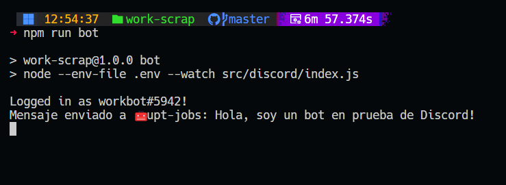
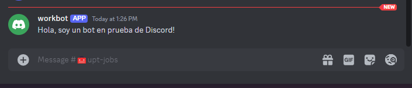

# Web scraping para y bot de discord 🤖

Este proyecto combina web scraping y un bot de Discord utilizando DiscordJS y Puppeteer. El bot puede interactuar con los usuarios en un servidor de Discord y realizar tareas automatizadas en la web, como extraer información de sitios web y proporcionar respuestas basadas en esos datos.

## Estadísticas del Repositorio 📊


## Tecnologías Utilizadas 💻

- **MySQL** (v8.0.27) [](https://www.mysql.com/)
- **Node.js** (v14.17.5) [](https://nodejs.org/)
- **npm** (v7.24.0) [](https://www.npmjs.com/)
- **Docker** (v20.10.8) [](https://www.docker.com/)
- **DiscordJS** (v14.15.3) [](https://discord.js.org/)
- **Puppeteer** (v22.11.0) [](https://pptr.dev/)


## Instalación y Configuración 🛠️

Siga los siguientes pasos para configurar el proyecto localmente:


1. **Instalar Node.js y npm**: Si aún no tienes Node.js y npm instalados en tu máquina, puedes descargarlos e instalarlos desde [nodejs.org](https://nodejs.org/).
2. Clone el repositorio:
   ```bash
   https://github.com/jmorales01/work-scraper.git
   ```
3. Navegue al directorio del proyecto:
4. Instale las dependencias del proyecto:
   ```bash
   npm install
   ```
3. Ejecute el proyecto:
   ```bash
   npm start
   ```

¡Ahora deberías tener el proyecto en funcionamiento en tu máquina local! 🚀


## Puppeteer

- **Selección de elementos HTML:**
   - Seleccionar por ID `page.$('#idDelElemento');`
   - Seleccionar por clase `page.$('.claseDelElemento');`
   - Seleccionar por etiqueta `page.$('p');`
   - Seleccionar por atributo `page.$('[data-test="example"]');`
   - Otras comvinaciones
   ```
      'button[data-action="submit"]'
   ```

- **Funciones de puppeteer:**
   - Capturar pantalla `page.screenshot({path: 'turuta.png'});`
   - Escribir en un campo de entrada `page.type('.campoDeEntrada', 'Texto de ejemplo');`
   - Click a un boton  `page.click('button[aria-label="Next page"]');`
   - Navegar a una URL  `page.goto('https://example.com');`
   - Esperar a que un selector esté disponible `page.waitForSelector('#id');`
   - Capturar un PDF de la página `page.pdf({ path: 'page.pdf', format: 'A4' });`
   - Manejar eventos del teclado `page.keyboard.press('Enter');`


## Licencia 📄

Este proyecto está bajo la licencia MIT. Consulte el archivo [LICENSE](LICENSE) para más detalles.

---

##¡Gracias por visitar mi repositorio! 🌟🧑‍💻


---
<div align="center">
  
  
</div>